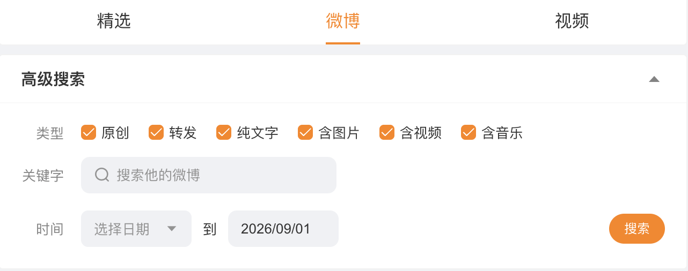

# weibo-core

微博账号帖子列表抓取与导出 CLI。支持按数字 UID、账号名称或 TXT 批量输入，持续翻页抓取账号帖子并导出 JSON + CSV。本项目只维护帖子索引与文本元数据，不下载图片、音频或视频。

## 许可与使用声明

本项目以 **GNU Affero General Public License v3.0 or later（AGPL-3.0-or-later）** 开源。任何人都可以使用、研究、修改和再分发本项目，也可以在遵守许可证的前提下用于商业场景；向他人分发本项目或修改版时，必须依照 AGPL 提供对应源码。若修改后作为网络服务供用户交互，也必须向这些用户提供正在运行版本的对应源码。转载、修改和分发时还应保留版权、许可证及第三方来源说明。

本项目维护者仅以非商业目的开发、研究和公开本项目源码，不通过本项目提供收费抓取、数据出售或其他商业化服务。项目在使用者本地运行，维护者不参与、不控制，也不代表任何第三方对本项目的下载、修改、部署或使用；第三方实施的行为属于其独立行为，相应责任由实施者依法自行承担。

本项目仅供学习、研究和技术参考。该表述说明项目定位，不构成对 AGPL 已授予权利的额外用途限制。使用者应自行遵守适用法律法规、微博服务条款、隐私与数据保护要求，合理控制请求频率，不得将本项目用于侵害他人权益、破坏平台正常运行或其他违法用途。

本软件按“现状”提供，不附带任何明示或默示担保。在适用法律允许的最大范围内，使用、修改、部署或分发本项目所产生的账号限制、数据损失、合规、法律及其他风险由使用者自行判断和承担。维护者的非商业开发和公开源码能够清楚说明本项目的发布目的与实现内容，但不应被理解为对任何主体作出“绝对无风险”的法律保证，也不排除适用法律规定的不可免责责任。完整法律条款以 [`LICENSE`](LICENSE) 为准，第三方来源及其许可证见 [`THIRD_PARTY_NOTICES.md`](THIRD_PARTY_NOTICES.md)。

## 实现选择

核心抓取直接调用微博 JSON 接口，不依赖页面 DOM：

- 名称搜索：`weibo.com/ajax/side/search`；
- 账号资料：`weibo.com/ajax/profile/info?uid=...`；
- 高级搜索：`weibo.com/ajax/statuses/searchProfile?uid=...&page=...`，启用原创、转发、纯文字、图片、视频、音乐六种类型；
- 个人页时间线：`weibo.com/ajax/statuses/mymblog?uid=...&page=...`；
- 账号帖子（默认）：依次枚举上述两个独立数据源，按微博 ID 求并集去重；
- 长微博正文：仅对 `isLongText` 帖子调用 `weibo.com/ajax/statuses/longtext`。

### 调研来源与实现边界

- [dataabc/weibo-crawler](https://github.com/dataabc/weibo-crawler)：用于了解按单个/多个 UID 或 TXT 配置抓取、原创与转发建模、增量更新及 JSON/CSV 导出的成熟产品形态。该项目是基于移动版微博的 Python 爬虫，与本项目使用的桌面端 `weibo.com/ajax` 接口和 TypeScript 代码结构不同。其仓库当前未提供明确的 `LICENSE` 文件，因此本项目没有复制或改写其源代码，只参考功能需求和公开输出设计。
- [NanmiCoder/MediaCrawler 的微博客户端](https://github.com/NanmiCoder/MediaCrawler/blob/main/media_platform/weibo/client.py)：用于验证“浏览器只负责取得/刷新 Cookie，后续内容抓取由 HTTP 客户端调用 API”这一架构可行，也参考了请求重试、Cookie 更新和移动端容器接口的处理思路。MediaCrawler 依赖 Playwright 页面并使用 `m.weibo.cn`，本项目则默认通过微博 Passport 的纯 HTTP 二维码取得 Cookie，帖子抓取使用 `weibo.com/ajax`，仅把 Agent 已有浏览器作为登录备用方案。MediaCrawler 采用 `NON-COMMERCIAL LEARNING LICENSE 1.1`；本项目没有复制或改写其代码。
- [jackwener/weibo-cli 的二维码登录实现](https://github.com/jackwener/weibo-cli/blob/main/weibo_cli/auth.py)：本项目的 Passport 二维码认证流程由其 Python 实现改写为 TypeScript，包括取得 `X-CSRF-TOKEN`、申请二维码、终端展示、轮询扫码状态和跟随 SSO 跨域地址换取 Cookie。上游在 `pyproject.toml` 和 README 中声明 Apache-2.0；本项目保留来源说明，并在 [`LICENSES/Apache-2.0.txt`](LICENSES/Apache-2.0.txt) 附上许可证文本。TypeScript 版本另外实现了 `tough-cookie` CookieJar、二维码 PNG、激活延迟、凭证校验与项目内 `0600` 存储，不使用其 Python 包，也不读取本机浏览器 Cookie。

“没有作为运行时依赖”不等于“没有许可证义务”：将 Python 代码翻译或改写为 TypeScript 仍可能构成改编，因此上述二维码登录明确按改编处理并保留 Apache-2.0 来源；其余两个项目仅作为调研材料，不包含其代码。更完整的第三方声明见 [`THIRD_PARTY_NOTICES.md`](THIRD_PARTY_NOTICES.md)。

### Cookie 与登录边界

- `weibo login` 直接调用微博 Passport 二维码 API，在终端显示二维码并轮询扫码状态；全程不启动浏览器。
- 扫码确认后，脚本通过 SSO 跨域接口换取 `SUB`/`SUBP` 等 Cookie，并以 `0600` 权限保存到项目 `.cache/weibo/credential.json`。
- 后续搜索、资料和所有帖子分页都只走 HTTP API，不需要 Playwright、Chromium 或浏览器自动化；但每次 HTTP API 请求仍会自动携带已保存的登录 Cookie。
- 项目本身不依赖 Playwright/Puppeteer，也不会下载浏览器。二维码持续失败时，可由 AI Agent 在用户同意后调用其已有浏览器工具完成官方登录，再把 Cookie 交给 CLI 校验保存。
- 2026-08-29 实测完全不带 Cookie 时，`mymblog` 和 `searchProfile` 的第 1 页、第 2 页全部返回 `ok=-100`。因此本项目当前的资料/帖子 API 抓取需要登录态，不能作为匿名爬虫使用。
- “HTTP 二维码登录”的意思是不启动浏览器也能完成认证，不是跳过登录。扫码换取的 `SUB`/`SUBP` 等 Cookie 就是后续 HTTP 请求的登录凭证；一次登录后会静默复用，所以正常抓取过程不会再弹出登录提示。
- `WEIBO_COOKIE` 仅作为 CI 或服务器环境的手动后备输入。

## 安装

```bash
npm install
npm run build
```

## AI Agent Skill

项目内置了面向 AI Agent 的操作说明：[`.agents/skills/weibo-core/SKILL.md`](.agents/skills/weibo-core/SKILL.md)。支持项目级 `.agents/skills` 的 Agent 可以在打开本仓库后发现它；其他 Agent 也可以被明确要求先读取该文件，再操作 CLI。Skill 不是运行时依赖，不会安装浏览器、Playwright 或其他控制库。

使用者不需要记忆全部命令，可以直接向 Agent 描述目标，例如：

```text
检查 weibo-core 登录状态，然后抓取这个 UID 的全部公开帖子。
读取 accounts.txt，批量同步里面的微博账号；若登录失效先使用默认二维码。
二维码持续失败时，告诉我可以选择哪些浏览器备用登录方式，不要自动安装工具。
```

Skill 会约束 Agent 先检查登录状态，默认使用纯 HTTP 二维码，只在用户同意后使用已有浏览器能力；帖子列表始终由 HTTP API 抓取。它还说明了高级搜索与旧时间线求并集、完整性判断、风控重试、媒体输出边界，以及公开测试与本地真实资料的隔离规则。

## 扫码登录（全量抓取需要）

```bash
node bin/weibo.js login
# 兼容别名
npm run get-cookie
```

命令申请二维码后默认等待 60 秒再在终端打印。实测 Passport 新 qrid 在连续登录后可能存在短暂同步/冷却窗口，过早扫码会被手机端误报“二维码已失效”；等待后再扫可以正常完成。用微博 APP 的“扫一扫”扫码并在手机确认，Cookie 会自动保存；不会打开浏览器。等待时间可用 `--activation-delay <秒>` 调整，也可以手动把完整 Cookie 填入 `WEIBO_COOKIE`。

终端二维码同时保存到 `.cache/weibo/login-qr.png`，终端字体或 ANSI 颜色影响扫描时可以直接打开该图片；用 `--qr-file <路径>` 可修改位置。

```bash
node bin/weibo.js status
node bin/weibo.js logout
```

### AI Agent 的浏览器备用登录

浏览器只用于登录，不参与帖子抓取。项目级操作说明位于 [`.agents/skills/weibo-core/SKILL.md`](.agents/skills/weibo-core/SKILL.md)：Agent 应先尝试默认二维码；持续失败时让用户选择是否启用浏览器，并检查自己已有的浏览器工具和二进制，不能自动安装或下载。

浏览器工具取得包含 `SUB` 的完整 Cookie 后，通过标准输入交给 CLI；Cookie 不应作为命令行参数或显示在日志中：

```bash
node bin/weibo.js import-cookie
node bin/weibo.js status
```

`import-cookie` 会先在线验证，再以 `0600` 权限保存。普通用户无需记忆浏览器自动化命令，直接让支持项目 Skill 的 AI Agent 执行即可。

## 使用

### 按名称查 UID

```bash
node bin/weibo.js lookup 示例账号甲
node bin/weibo.js lookup 示例账号甲 --json
```

完全同名时直接输出 UID；否则列出候选账号。

### 预览帖子

```bash
node bin/weibo.js list 1000000001 --limit 10
node bin/weibo.js list --name 示例账号甲 --limit 10
node bin/weibo.js list 1000000001 --limit 10 --json
```

### 导出全部帖子

```bash
node bin/weibo.js export 1000000001
node bin/weibo.js export --name 示例账号甲
```

结果写入：

```text
data/{账号名称}/{uid}.json
data/{账号名称}/{uid}.csv
```

调试或小范围验证可限制数量或页数：

```bash
node bin/weibo.js export 1000000001 --limit 20
node bin/weibo.js export 1000000001 --max-pages 2
```

抓取分为三阶段：先完整枚举高级搜索，再完整枚举旧时间线；按微博 ID 求并集去重；最后只对并集中确有截断的微博并发补全正文。三个阶段使用独立客户端，但共享登录会话和请求启动调度器。高级搜索与正文详情默认保持 300ms；账号资料报告超过 1200 条时，只把该账号的旧时间线客户端切换到 600ms，并在旧时间线每 40 页主动暂停 20 秒。旧时间线实际收集满 1200 条后，该账号后续旧时间线请求提高到 1200ms。快速模式如果遇到可重试的网关、风控或网络异常，也只调整发生异常的阶段客户端。可用 `--safe` 从一开始强制整个命令保守运行，用 `--delay <毫秒>` 调整快速间隔。`--no-full-text` 可完全跳过正文补全请求。

#### 为什么默认合并两个接口

微博个人主页的默认时间线并不保证列出该账号的全部公开微博。网页上展开“高级搜索”时，虽然“原创、转发、纯文字、含图片、含视频、含音乐”六项默认都是勾选状态，但仍需再点击一次“搜索”，网页才会切换到另一套、在本次目标上明显更完整的结果集。无限下滑只是分页的界面表现；点击搜索前后的分页数据源本身不同。

官方网页当前把这六个选项分别映射为 `hasori=1`、`hasret=1`、`hastext=1`、`haspic=1`、`hasvideo=1`、`hasmusic=1`，并请求 `/ajax/statuses/searchProfile`。旧主页时间线使用 `/ajax/statuses/mymblog` 和 `feature=0`。因此这不是在旧接口上“默认只勾选了部分类型”，而是两个独立接口；把高级搜索参数传给旧接口不能补齐缺失结果。

本项目在 2026-08-29 对一个中等规模的公开账号（下称“账号 A”）做过真实对照：旧时间线过滤后约 160 条，高级搜索约 280 条，两边交集约 150 条；高级搜索独有一百余条，旧时间线也有少量独有项，因此两边互不包含。一条事先确认存在的公开目标微博只出现在高级搜索中，相关关键词的多条结果也只能由高级搜索补齐。

同日对另一个约 240 条帖子的公开账号（下称“账号 B”）实测得到反向结果：旧时间线与账号本人确认的数量一致，高级搜索少 2 条。高级搜索结果全部包含在旧接口中；旧接口独有项都是本人发出的公开转发，不是点赞/评论活动卡，被转发原帖也仍可访问。无时间限制、仅选转发、按年分段都无法让这 2 条进入高级搜索结果。

第三个接近 3000 条帖子的公开账号（下称“账号 C”）将差距进一步放大：高级搜索虽报告约 2600 条，却只能枚举约 1100 条；旧时间线过滤后保留约 2700 条。两边有约 1100 条交集，高级搜索仍有 1 条旧接口没有的帖子，而旧时间线有超过 1600 条高级搜索没有的帖子，因此这个大账号同样是两边互不包含，不是单纯的旧接口包含高级搜索。

第四个账号（下称“账号 D”）体现了账号资料报告数与两个列表接口之间的另一种差异：资料 API 的 `statuses_count` 为 4,054；高级搜索自身报告 3,487 条，但 23 页自然耗尽后实际保留 904 条；旧时间线自身报告 4,054 条，但 96 页自然耗尽后实际保留 1,898 条。两边求并集后共 1,907 条，其中交集 895 条、高级搜索独有 9 条、旧时间线独有 1,003 条。账号 A 说明两个列表接口会互相缺少帖子，账号 D 则进一步说明资料 API 和列表接口各自的报告值也不能推导实际可枚举数量；两者是不同案例。

四次对照的完整 JSON、CSV、独有项和参数补测仅保留在本地 `test-output/` 和 `data/` 目录中。这些目录可能包含大量公开帖子数据，已通过 `.gitignore` 排除，不属于项目源码分发内容；公开文档只保留完成技术论证所需的去标识汇总和结论。

四次实测推翻了“某一个接口总是更全”的假设：两边可能互不包含，也可能任一方包含另一方，差距还可能非常大。同一账号在不同运行中，两个接口报告的 `total`、实际返回条数和独有项也可能变化；后一次结果不保证大于或等于前一次，客户端无法据此推断稳定的包含关系。因此 CLI 默认使用 `combined` 模式，依次枚举两边再求并集。“全类型”只表示高级搜索的六种筛选均开启，不代表微博服务端承诺绝对全集。

账号资料 API 的 `statuses_count` 同样不能当作真实总数。资料 API、高级搜索和旧时间线的数字分别来自不同查询层，可能同时偏多、偏少或互不包含；不能用其中一个数字推导另外两个，也不能据此断定缺失内容一定可见、已删除或属于某一种帖子类型。`statuses_count` 在 CLI 中仅用于排序和超量账号风控策略。

网页上的对应关系如下：

1. 打开他人的个人主页，进入“微博”页签，顶部类似“全部微博（223）”的数字，是网页展示的账号资料/主页报告数，对应资料 API 的 `statuses_count`，不是本项目实际分页数。
2. 停留在个人主页的默认微博列表中持续下拉加载，不打开或提交高级搜索，这条默认时间线对应旧接口 `mymblog`。
3. 点击微博页右侧的搜索入口打开“高级搜索”；保持“原创、转发、纯文字、含图片、含视频、含音乐”全部勾选，关键词留空，开始日期不填，结束日期使用当天日期，然后点击“搜索”，再持续下拉加载结果，这对应高级搜索接口 `searchProfile`。


上图中的“全部微博（223）”是网页报告数；右侧搜索框是高级搜索入口。未提交高级搜索时，继续下拉页面正文区域得到的是旧时间线。



上图是高级搜索展开后的条件：六种类型全部勾选、关键词为空、开始日期为空、结束日期为当天。点击右侧“搜索”后再下拉，才是高级搜索结果。

如需留存证据，可在同一次登录网页会话中分别截取上述三处，并记录截图时间、筛选项和登录状态。仓库中的两张示意图只展示不含账号身份的微博页面控件，用来说明网页上的三个数据源；公开仓库只保留“案例 D（资料 API 4,054、高级搜索实际 904、旧时间线实际 1,898、并集 1,907）”这类匿名描述，不提交包含真实账号名称、UID、正文或 Cookie 的截图。

同一账号的两个分页源不并行交错。对账号 B 的回归中，交错请求时高级搜索比紧接着单独顺序运行少 3 条；顺序运行找回了这 3 个明确对象。由于微博服务端的查询上下文、缓存或分页实现无法从客户端确定，本项目选择准确性优先：先跑完 `searchProfile`，再跑 `mymblog`。两边都完成后先按 ID 去重，再请求长正文，不会为共同帖子重复补详情。

需要注意，两个接口的 `total` 都可能与最终可分页枚举数量不一致。合并模式不会将两个重叠集合的 `total` 相加；总层 `reportedTotal` 为 `null`，两边的报告值、实际数量和页数分别保存在 `crawl.sourceStats`。

#### 为什么不是每篇帖子都请求正文详情

微博分页接口返回的不是单纯的帖子链接，而是已经包含作者、正文、发布时间、赞/评/转、媒体类型等字段的帖子对象。普通短帖的 `text` / `text_raw` 就是完整正文，不需要再次请求。只有正文超过分页展示长度、分页内容被截断时，才需要调用 `/ajax/statuses/longtext` 取得完整正文。

微博的 `isLongText` 标记并不完全可靠：部分短图片帖或短视频帖也会被标成 `true`，但调用长正文接口只返回空的 `data`。例如本项目实测的一条短图片帖，分页已经返回完整短正文并包含 11 张图片；长正文接口返回 `{ "ok": 1, "data": {} }`，所以再次请求没有意义。另一条实测长帖的分页正文只有约 151 个字符，而 `textLength` 为 882，调用长正文接口后才能取得完整内容。

因此默认流程会结合 `isLongText`、`textLength` 与分页正文长度，只为确实疑似截断的帖子补全正文；并且先完成全部分页，再并发处理这些正文请求。这样既保证长微博内容完整，也避免大量空详情请求拖慢分页。使用 `--no-full-text` 时不会调用长正文接口，因此被截断的长微博只会保留分页返回的摘要。

### TXT 批量同步

```bash
node bin/weibo.js sync accounts.sample.txt
```

批量同步默认同时处理 3 个账号。旧时间线先以并发 1 完成预检超过 1200 条的账号，之后普通账号最多允许 2 个同时进入；可用 `--concurrency <N>` 调整账号 worker，用 `--feed-concurrency <N>` 调整普通阶段的旧时间线并发。例如：

```bash
node bin/weibo.js sync accounts.sample.txt --concurrency 3 --feed-concurrency 2 --detail-concurrency 3
node bin/weibo.js sync accounts.sample.txt --safe
```

`sync` 正式抓取前会先为 TXT 中已解析的账号请求一次资料接口，读取 `statuses_count` 作为规模估计，并按估计值从多到少安排抓取。这个字段只是调度依据，不代表最终可枚举帖子总数；预检失败的账号会排到末尾并在正式导出时再次尝试。排序主要让大账号更早进入队列，使其分页和可能的重试更早开始，不改变账号并发数或两个接口的合并规则。

#### 为什么旧时间线使用不同参数

多轮真实批量测试中，`searchProfile` 高级搜索和 `longtext` 正文详情都没有出现 414；已观察到的 414 全部来自 `/ajax/statuses/mymblog`，并集中在大账号的深分页。触发后，同一目标的旧时间线连第 1 页都可能继续返回 414，而高级搜索和账号资料仍为 200。另一个约 2200 条的目标却能在相同登录和 IP 下完成，因此客户端只能推断限制可能同时与目标 UID、微博后端分片、Cookie、IP 和请求节奏有关，不能把 414 简化为 URL 太长、登录失效、某一固定页损坏或纯 IP 限流。

基于这个端点差异，最终参数不是三阶段统一降速，而是只给旧时间线增加深分页保护：

最后一轮控制变量进一步把高级搜索与旧时间线拆成独立客户端：此前大账号会让共用的列表客户端整体升到 600ms，实际连高级搜索也会被降速；现在自动大账号保护只把旧时间线升到 600ms，高级搜索继续保持 300ms。两者仍共享登录会话和请求启动调度器，因此没有增加登录或无节制并发。公开回归测试验证了作用域隔离；随后三个真实 TXT 批次全部自然耗尽且没有 414、重试或失败：包含一个约 2860 条大账号的 9 账号批次用时 4分46秒，6 个中小账号批次用时 25秒，包含约 2200 条和 1500 条两个大账号的 10 账号批次用时 7分55秒。旧时间线的其他参数在本轮中均未改变，因此保留这一拆分方案。

| 阶段 | 请求间隔与并发 | 特殊保护 | 选择原因 |
| --- | --- | --- | --- |
| 高级搜索 `searchProfile` | 独立客户端 300ms；最多由 3 个账号 worker 同时推进，每个账号内部逐页串行 | 不因账号超过 1200 条而升到 600ms，不使用每 40 页暂停，不切换到深分页 1200ms | 实测未出现 414；与正文详情基础间隔相同，但分页并发模型不同 |
| 旧时间线 `mymblog` | 先串行枚举所有资料数超过 1200 条的大账号；全部结束后，普通账号最多 2 个同时枚举。大账号实际收集前 1200 条使用 600ms，之后仅该账号、仅此端点使用 1200ms | 每 40 个逻辑分页请求暂停 20 秒；失败页原样重试 | 所有实测 414 都发生在此端点，且集中于深分页 |
| 正文详情 `longtext` | 独立客户端 300ms，每个账号并发 3 | 不继承旧时间线的 600/1200ms、固定暂停或旧时间线槽位 | 实测未出现 414；并发 10 对总耗时没有有效改善 |

这里的“前 1200 条”是旧时间线本次实际收集并按帖子 ID 去重、过滤非目标作者后的数量，不使用 API 不稳定的 `total` 作为切换依据。某一页可能让计数从 1190 跳到 1208，因此终端切换日志不一定恰好显示 1200；切换只影响下一页及后续旧时间线请求。高级搜索、正文详情和其他账号不会被这个 1200ms 端点级间隔连带降速。

批量任务保留 3 个账号 worker，并共享“请求启动”调度器以错开请求。每个账号的高级搜索、旧时间线和正文详情分别使用独立客户端。旧时间线使用两阶段屏障：先按预检资料数判断超量账号并让其从第 1 页开始串行枚举；只要还有一个超量账号尚未结束旧时间线，普通账号即使已经完成高级搜索也会等待；全部超量账号结束后，普通账号才以并发 2 枚举。预检失败的未知账号按超量账号保守处理，避免绕过屏障；若账号在进入旧时间线前失败，也会释放其阶段名额，避免普通账号永久等待。大账号旧时间线进入保守模式或重试冷却时，不会改变高级搜索和正文详情自身的请求间隔。

终端分页日志不显示不可信的 `已收集 x/API total`。为了避免刷屏，每个数据源只显示“开始”、第 10、20、30…页和“完成”；完成行只报告实际页数、实际收集数和停止原因。API 原始 `total` 保留在 JSON 的 `crawl.sourceStats` 中供调试，但不作为终端进度分母。

账号完成行中的“用时”是该账号的墙钟用时，从账号 worker 输出“开始”时计时，到该账号全部导出完成时结束。它包含高级搜索、等待旧时间线阶段/槽位、旧时间线抓取和正文详情补全，不等于该账号持续发送请求的净耗时。多个账号 worker 会同时启动，因此各账号的计时区间互相重叠，不能把完成行里的用时直接相加；整批实际耗时以最后的“总用时”为准。例如三个超量账号同时开始后依次完成旧时间线，完成行可能分别显示 10、11、16 分钟，其中第二、第三个数字已经包含等待前面账号的时间，三者共同占用的墙钟时间约为最大值 16 分钟，而不是三项之和 37 分钟。

每一页如果返回非空 `since_id`，下一页会同时携带该游标和页码；如果明确返回空游标，则当前页就是自然尾页，不再无游标探测下一页；如果完全没有游标字段，则清除上一页游标并按页码继续。这样可避免服务端重复旧页并误报 `pagination-stalled`。这对深分页很重要：本项目实测旧时间线第 80 页之后，不带正确游标时接口报告数会从约 2860 变成约 2810。

#### 控制变量记录

以下结果来自同一组本地匿名账号批次的重复实测。微博返回集合和风控状态本身会波动，因此这些数据用于解释项目参数如何形成，不代表微博接口的永久阈值。

| 控制变量 | 尝试过的方案 | 观察结果与最终选择 |
| --- | --- | --- |
| 两个列表源的执行顺序 | 同账号并行交错；高级搜索完成后再跑旧时间线 | 交错请求曾让高级搜索少 3 条，立即顺序重跑可找回；最终同账号严格顺序、两边完成后求并集 |
| 保守状态作用域 | 一个大账号使整批全局降速；每账号独立；每账号再按高级搜索、旧时间线、正文详情拆分 | 全局 1200ms 虽曾让约 2860 条目标一次通过，但 10 账号批次增至约 22.5 分钟，441 条正文详情单独约 8 分钟；最终让三个阶段使用独立客户端，自动大账号保护只作用于旧时间线 |
| 自动大账号保护的阶段范围 | 高级搜索与旧时间线共用客户端，二者均为 600ms；拆成独立客户端，高级搜索 300ms、仅旧时间线 600ms | 三个真实 TXT 批次分别用时 4分46秒、25秒和 7分55秒，全部自然耗尽且没有 414、重试或失败，最终保留拆分方案 |
| 账号 worker | 3；整体降为 2 | 高级搜索和正文详情没有同类问题，整体降到 2 会浪费吞吐；最终账号 worker 保持 3 |
| 旧时间线账号并发 | 3；全体 2；超量阶段 1、普通阶段 2 | 新增账号后的 15 账号批次中，两个超量账号在各自第 40 次请求暂停后同时触发 414；这发生在实际收集满 1200 条之前，因此不能等到深分页阈值才降并发。随后让两个超量账号从第 1 页起串行，同一 Cookie 下分别自然耗尽 328 页和 107 页，均未重试。当前改为先串行完成全部超量账号的旧时间线，再放行普通账号并发 2，等待完整 TXT 批次继续验收 |
| 正文详情并发 | 3；10 | 三个大账号对照总耗时分别为 415.05 秒与 414.29 秒，几乎无收益；最终保留 3 |
| 大账号基础间隔 | 全局 1200ms；整个账号 600ms；仅旧时间线 600ms | 全局或整个账号降速会无谓拖慢高级搜索和正文详情；最终只让大账号旧时间线前 1200 条使用 600ms，其他两个阶段保持 300ms |
| 固定暂停时长 | 不暂停；每 40 页暂停 5、10、15、20 秒 | 5/10/15 秒没有稳定消除 414；保留 20 秒时约 2860 条批次为 8分03秒、一次 414，取消暂停后为 12分11秒、连续两次 414，因此恢复 20 秒 |
| 414 重试等待 | 15/45 秒；120/300 秒；150/300 秒；300/300 秒；180/300 秒 | 短等待和 120/150 秒在对应测试中不足；首次 300 秒能恢复但浪费时间；保留固定暂停时首次 180 秒可恢复并比 300 秒节省 2 分钟，因此最终为 180 秒、300 秒 |
| 深分页间隔 | 旧时间线全程 600ms；全程/全局 1200ms；实际收集 1200 条后由 600ms 切到 1200ms | 最终分段方案中，约 2860 条批次 142 页自然耗尽、无 414，总用时 4分53秒；另一 10 账号批次也无 414，总用时 8分02秒。相较全局 1200ms，保护了风险区间又没有拖慢正文详情和其他账号 |
| 账号处理顺序 | TXT 原顺序；按资料 `statuses_count` 从多到少 | 预估数不用于判定完整性，但可让超量账号先进入串行旧时间线阶段；全部超量旧时间线结束后，普通阶段再按并发 2 放行，最终保留降序调度 |

最终重试仍是兜底而不是正常流程：414 后保留已收集帖子、当前页码和 `since_id`，第 2 次尝试前只暂停当前账号 180 秒并把其通用后续间隔提高到至少 1500ms；若仍失败，第 3 次尝试前暂停 300 秒并提高到至少 3000ms。不会从第 1 页重新抓取，也不会让其他账号共同等待。最终分段间隔的两批验收没有进入重试，但保留该机制应对微博服务端波动。

`--safe` 表示整个命令全程使用保守方案：从第一个 HTTP API 请求开始，将 TXT 里所有账号、高级搜索、旧时间线和正文详情都设为至少 600ms；旧时间线仍每 40 页暂停 20 秒，并在实际收集满 1200 条后将该账号后续旧时间线提高到 1200ms。它不改变两阶段屏障：资料数超过 1200 条的账号仍先以并发 1 完成旧时间线，之后普通账号才按 `--feed-concurrency` 进入；账号 worker 由 `--concurrency` 控制。

长时间性能测试必须保持机器唤醒。macOS 睡眠期间 Node.js 进程会暂停，唤醒后可继续完成，但终端墙钟耗时会把睡眠时间一起算入，且可能产生无 HTTP 状态的瞬时网络异常。本项目的一次完整对照因系统多段睡眠被记录为 31 分钟，电源日志确认其中包含约 29 分钟睡眠，该数字不能用来比较抓取参数。

macOS 上做耗时对照时可用 `caffeinate` 仅在命令运行期间防止系统空闲睡眠：

```bash
caffeinate -i node bin/weibo.js sync accounts.sample.txt
```

仅自己可见、粉丝可见、已删除或索引残留帖子可以造成账号报告数与实际可枚举数不一致：本地登录账号只能取得它本来有权看到的内容。但这些可见性差异通常表现为帖子缺口、空占位或 403，不是 `mymblog` 整个分页请求的 HTTP 414。

只有当前页第 3 次仍失败时，该账号才会被标记为失败，且不会将不完整结果写成成功。这不代表登录过期；可在确认 `node bin/weibo.js status` 有效后，用更大的 `--delay` 单独重跑失败账号。

每行支持以下任一格式，空行和 `#` 注释会被忽略，重复账号会去重：

```text
1000000001 # 示例账号甲
https://weibo.com/u/1000000002
示例账号乙
```

## 输出字段

JSON 保存账号资料、抓取覆盖信息，以及按帖子 ID 索引的帖子对象。帖子包含：

- API 当前返回的纯文本正文；对确有扩展正文的长微博会自动补全；
- 发布时间、来源、地区、赞/评/转；
- 置顶、转发及被转发原帖；
- 统一、稳定的微博帖子跳转地址 `url`；
- `mediaType`、`mediaCount`、`pictureCount`、`videoCount`，可识别单图、多图、视频和图视频混合帖。
- `listingSources`，标记帖子来自高级搜索、旧时间线或两者共同返回。

不保存图片或视频 CDN 直链：这些地址带短期签名，之后打开可能返回 402/403。需要查看图片、视频或混合媒体时统一打开帖子 `url`。CSV 保留顶层帖子字段，并额外将一层 `retweetedStatus` 展平为 `retweeted_*` 列（包括原帖作者、正文、媒体统计和地址），便于在表格中搜索转发原帖内容；媒体下载不属于本项目范围。

时间采用统一契约：微博接口原始时间必须带明确时区，`createdAt` 和 `updatedAt` 保存为 UTC ISO 8601 绝对时刻；CLI 展示固定转换为 `Asia/Shanghai`。高级搜索的结束日期也按北京时间的次日零点计算，不依赖运行爬虫的电脑时区。下游合并程序应原样保留这些绝对时刻，只按时间排序；录播使用的 06:00 归档规则不适用于微博。

CSV 中 `text`、`media_*` 和 `url` 始终表示顶层微博（也就是转发者自己的评论/媒体及转发地址）；`retweeted_text`、`retweeted_media_*` 和 `retweeted_url` 表示被转发原帖。顶层 `mid`、`user_id`、`created_at_raw` 以及原帖对应的 `retweeted_*` 标识和原始时间字段也会保留。JSON 仍是完整嵌套数据的权威格式，CSV 是方便筛选的扁平副本。

### JSON 键名完整对照

下面列出当前导出文件实际写入的全部键名。`{uid}.json` 的固定顶层结构如下：

| 键 | 类型 | 含义 |
| --- | --- | --- |
| `account` | object | 被抓取账号的资料 |
| `updatedAt` | ISO 8601 string | 本次导出生成时间 |
| `crawl` | object | 本次抓取的接口、覆盖范围和完整性状态 |
| `posts` | object | 以顶层微博 ID 为键的帖子对象字典；键通常与对象内 `id` 相同 |

`account` 内的键：

| 键 | 类型 | 含义 |
| --- | --- | --- |
| `id` | string | 账号 UID |
| `screenName` | string | 显示名称 |
| `description` | string | 账号简介 |
| `followersCount` | number 或 string | 粉丝数（微博接口可能返回数字或格式化字符串） |
| `verified` | boolean | 是否认证 |
| `verifiedReason` | string | 认证说明 |
| `statusesCount` | number | 账号资料接口报告的微博数，仅用于规模估计/排序，不代表最终可枚举总数 |
| `followCount` | number | 关注数 |
| `mbrank` | number | 微博会员等级字段 |
| `profileUrl` | string | 账号主页地址 |

`crawl` 内的键：

| 键 | 类型 | 含义 |
| --- | --- | --- |
| `sessionSource` | `configured-cookie` 或 `saved-credential` | 本次请求使用的登录态来源 |
| `listingSource` | `combined`、`profile-search` 或 `profile-feed` | 帖子列表来源；默认是两个接口并集 |
| `sourceStats` | object | 各分页源的独立统计，见下表 |
| `requestedAll` | boolean | 是否请求了全部帖子（没有使用 `--limit` 或 `--max-pages`） |
| `requestedLimit` | number 或 null | `--limit` 的有效值；未设置时为 `null` |
| `reportedTotal` | number 或 null | 合并结果的报告总数；并集模式下为 `null`，因为两个接口的报告值不可直接相加 |
| `pagesFetched` | number | 两个列表源实际请求的页数之和 |
| `exportedCount` | number | 最终按帖子 ID 去重后写入的顶层帖子数 |
| `filteredOutCount` | number | 因顶层作者不是目标账号或没有作者 UID 而排除的分页对象数；两个源的计数可能各计一次 |
| `exhausted` | boolean | 两个分页源是否都自然耗尽 |
| `stoppedReason` | `exhausted`、`limit`、`max-pages` 或 `pagination-stalled` | 抓取停止原因 |
| `completeAgainstReportedTotal` | boolean | 是否同时自然耗尽，并达到单一接口报告的总数；合并模式下主要表示是否自然耗尽 |

`crawl.sourceStats.profile-search` 和 `crawl.sourceStats.profile-feed`（当该源参与本次抓取时）各自包含：

| 键 | 类型 | 含义 |
| --- | --- | --- |
| `reportedTotal` | number 或 null | 该接口返回的报告总数，不保证等于实际可分页数量 |
| `pagesFetched` | number | 该接口实际请求页数 |
| `returnedCount` | number | 该接口通过顶层作者过滤并源内去重后保留的对象数 |
| `filteredOutCount` | number | 该接口排除的非目标作者/无作者对象数 |
| `exhausted` | boolean | 该接口是否自然耗尽 |
| `stoppedReason` | `exhausted`、`limit`、`max-pages` 或 `pagination-stalled` | 该接口停止原因 |

`posts[微博 ID]` 是顶层帖子对象，包含：

| 键 | 类型 | 含义 |
| --- | --- | --- |
| `id` | string | 微博帖子 ID |
| `mid` | string | 微博 MID |
| `bid` | string | 微博短链接标识 |
| `url` | string | 稳定的帖子网页地址；查看媒体时应打开此地址 |
| `userId` | string | 顶层帖子作者 UID |
| `screenName` | string | 顶层帖子作者名称 |
| `createdAt` | string 或 null | 规范化后的 ISO 8601 发布时间 |
| `createdAtRaw` | string | 微博接口原始发布时间 |
| `text` | string | 顶层帖子纯文本；本人转发时这里是本人的评论文字 |
| `source` | string | 发布客户端/来源 |
| `regionName` | string | 发布地区 |
| `attitudesCount` | number | 点赞数 |
| `commentsCount` | number | 评论数 |
| `repostsCount` | number | 转发数 |
| `isPinned` | boolean | 是否置顶 |
| `isRetweet` | boolean | 是否为转发帖 |
| `listingSources` | array | `profile-search`、`profile-feed`，或两者；表示该帖子由哪些列表源返回 |
| `mediaType` | `none`、`pictures`、`video`、`mixed` 或 `link` | 媒体类型 |
| `mediaCount` | number | 媒体总数 |
| `pictureCount` | number | 图片数量 |
| `videoCount` | number | 视频数量 |
| `retweetedStatus` | object 或 null | 被转发原帖；结构递归使用同一组帖子键 |

导出 JSON 不写入运行时使用的 `textHtml` 和 `textComplete` 字段，也不保存带短期签名的图片/视频 CDN 直链。若 `retweetedStatus` 继续包含转发原帖，其内部同样使用上述帖子字段，但不会再额外生成第二层 CSV 列。

`crawl.exhausted` 只有在两个分页源都自然耗尽时才为 `true`。使用 `--limit`、`--max-pages`，或某一数据源中断时，不会宣称是完整并集。

`crawl.listingSource` 默认为 `combined`；`crawl.sourceStats` 分别记录 `profile-search` 和 `profile-feed` 的分页结果。库调用者仍可明确传入单一 `listingSource` 做诊断对照。

终端中的“已自动排除非本人/无作者占位 N 条”表示：列表接口返回了一个帖子对象，但它的顶层作者不是正在抓取的目标账号，或者对象没有有效作者 UID，因此没有进入该账号的帖子结果。常见情况包括页面混入的“她赞过的微博”“她评论过的微博”、推荐/广告卡片，以及原作者删除或设置可见性后留下的无作者空占位。这不是 HTTP 请求失败，也不是正文详情接口失败；`N` 是分页源过滤计数，两个源都出现同一对象时可能各计一次，不等同于最终去重后的帖子数。

目标账号自己发出的转发（包括转发时附带评论文字）顶层作者 UID 仍是目标账号，必须保留；被转发原帖作为嵌套 `retweetedStatus` 保存，不参与顶层作者过滤。只有顶层作者 UID 不等于目标 UID，或缺少有效顶层作者 UID 的对象，才会显示在这个排除计数中。

### 什么是“顶层作者”

分页接口的每一个列表项都有一个顶层 `user.id`，本项目将它导出为 `post.userId`。它表示“这条顶层微博是谁发出的”，与页面上“谁赞过/评论过”的活动提示不是同一个概念。

- 本人原创：顶层 `post.userId` 等于目标 UID，`isRetweet=false`，保留。
- 本人转发：顶层 `post.userId` 等于目标 UID，`isRetweet=true`，保留。转发时本人附带的评论在顶层 `text`，原帖作者和正文在 `retweetedStatus.userId` / `retweetedStatus.text`。
- 赞过或评论过的他人微博：列表项可能显示“她赞过的微博”“她评论过”等提示，但顶层 `post.userId` 是原帖作者、不等于目标 UID，因此排除。
- 推荐或广告卡片：如果它以非目标作者的帖子对象混入，同样会被 UID 规则排除。本项目不依赖“广告”文案或页面 CSS 判断。
- 无作者的删除/私密空占位：缺少有效顶层 `userId`，也会排除。

因此当前过滤规则只回答“是不是目标账号发出的顶层帖子”，不会帮下游业务删除本人转发。如果使用者只需要本人原创，应在导出后按结构化字段过滤：

```js
const originalPosts = Object.values(result.posts).filter(post => !post.isRetweet)
const retweets = Object.values(result.posts).filter(post => post.isRetweet)
```

不应通过正文是否等于“转发微博”来判断：本人可以在转发时填写任意评论，例如“圣诞树🎄”仍然是 `isRetweet=true` 的转发帖。

## 测试

```bash
npm test
npm run test:time
```

公开的 [`test/core.example.test.mjs`](test/core.example.test.mjs) 是可直接执行的回归测试案例，只使用虚构账号、UID、帖子和接口响应。测试覆盖 TXT 混合输入、名称候选解析、HTML 正文、帖子/媒体字段、CSV 转义、跨页去重、双接口顺序枚举、并集来源标记以及共同长微博只补全一次。[`test/time.test.mjs`](test/time.test.mjs) 覆盖带时区时间规范化、北京时间显示和高级搜索次日零点；`test:time` 会在三个不同的进程时区中重复运行。

维护者可以在本地 `test/local/` 保存包含真实调研标识的测试副本；该目录已被 `.gitignore` 排除，`npm test` 也不会扫描子目录，因此不会进入源码分发或自动测试。真实联网对照输出仍保存在同样被忽略的 `test-output/` 和 `data/` 中。
